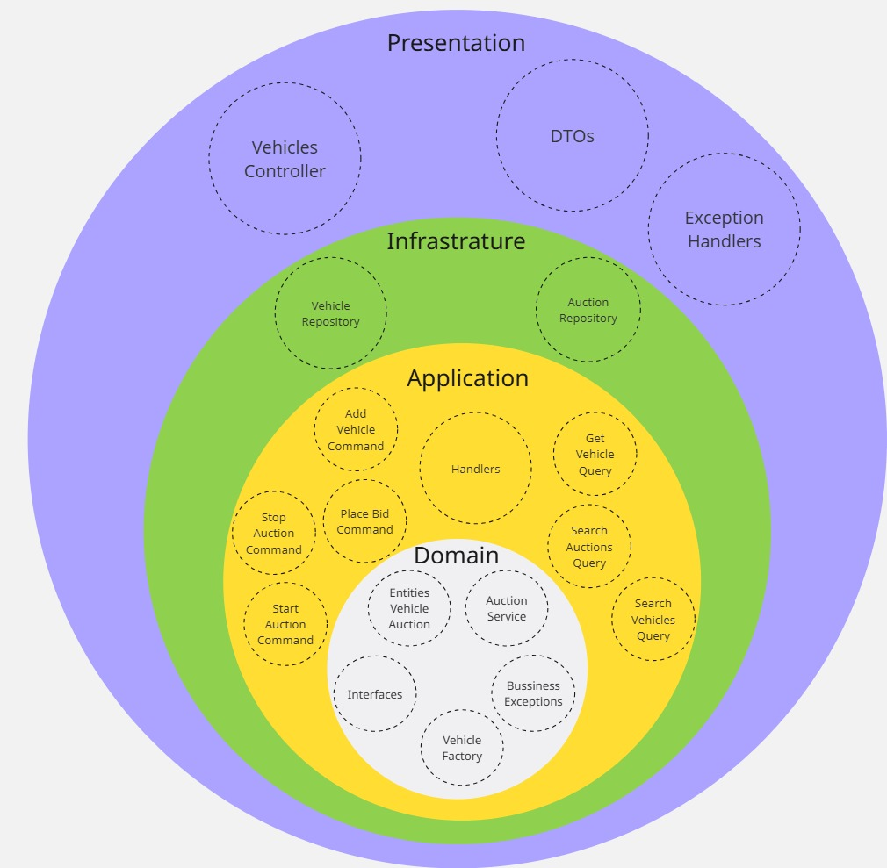

# 🚗 Vehicle and Auction Management API

This project is a **RESTful API** built with **ASP.NET Core**, designed to manage vehicles and their associated auctions. It follows **Clean Architecture principles**, with clear separation of concerns and a strong focus on maintainability and testability.

## Diagram

The diagram below illustrates the main architectural layers of the project and highlights the core components within each one — from domain entities and business logic to application handlers, infrastructure repositories, and presentation concerns.

---

## 🧱 Architecture & Technologies

- **.NET Core Web API** with versioned controllers (e.g., `V1`)
- **MediatR** for CQRS-style separation between controllers and business logic
- **FluentValidation** for expressive, rule-based command validation
- **Custom domain exceptions** to clearly represent business rule violations
- **In-memory generic repository** for fast iteration and testability
- **Unit tests** written with:
  - `xUnit`
  - `NSubstitute`
  - `FluentAssertions`
  - `FluentValidation.TestHelper`

---

## 🧪 Testing

The project includes comprehensive unit tests for:

- ✅ Command handlers (`AddVehicle`)
- ✅ Command validator, including conditional logic based on vehicle type
- ✅ `VehiclesController` — tested in isolation using `ISender` mock
- ✅ Generic in-memory repository (`MemoryRepository<T>`) — all operations covered
- ✅ Domain Business Rules — tested for correct error messages and types (`AuctionService`)

I haven't written as many tests as I would have liked, and while the in-memory database isn't ideal for all scenarios, I believe it serves the purpose of this project and keeps the focus on the core architecture and domain logic.

---

## 🔧 Key Features

- Add vehicles with **conditional validation** depending on type (e.g., `Truck`, `SUV`)
- Search vehicles by model, manufacturer, year, and type
- Search auctions of a vehicle by status
- Start, stop, and place bids on vehicle-related auctions